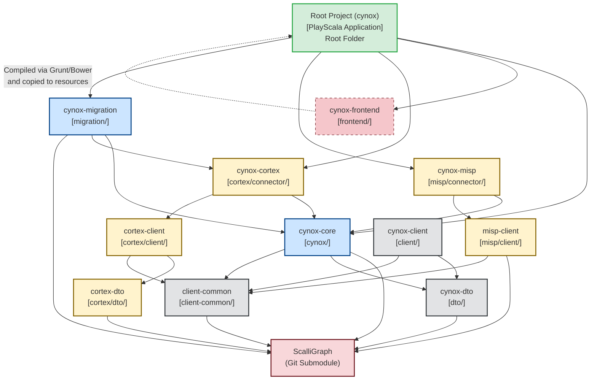

# Codebase Audit & Issues Report: Cynox 4 (Open Source Version)

This report highlights key issues, architectural challenges, and compatibility bottlenecks found in the current state of **Cynox 4** repository under `E:\Cynox New\Cynox-main`.

---

## 1. Critical Build Blockers (Immediate Failures)

These issues will prevent the project from compiling or building locally right out of the box.

### 🔴 Missing Git Submodule (`ScalliGraph`)
* **File/Path**: [ScalliGraph](file:///e:/THE%20Hive%20New/Cynox-main/Cynox-main/ScalliGraph) (Empty directory)
* **Details**: The backend codebase (`cynox-core`, `cynox-dto`, etc.) has a direct build dependency on the `scalligraph` project (configured in [build.sbt](file:///e:/THE%20Hive%20New/Cynox-main/Cynox-main/build.sbt)). Because the folder is empty, SBT compilation will fail immediately with missing reference errors.
* **Root Cause**: The project was likely cloned without `--recursive` or downloaded as a static ZIP archive, which excludes Git submodules.
* **Impact**: **High Blocker**. Compilation is impossible without initializing and updating this submodule.

### 🔴 Shut Down of Bintray Maven Repository
* **File/Path**: [build.sbt](file:///e:/THE%20Hive%20New/Cynox-main/Cynox-main/build.sbt#L16)
* **Details**: The repository config includes the following resolver:
  ```scala
  "Cynox project repository" at "https://dl.bintray.com/cynox-project/maven/"
  ```
  JFrog Bintray was permanently shut down in **May 2021**.
* **Impact**: **High Blocker**. Any dependencies that SBT tries to resolve specifically from this repository (such as custom Cynox packages or plugins) will fail to download, leading to resolution errors during build.

### 🔴 Missing Core Application Configurations
* **File/Path**: [conf](file:///e:/THE%20Hive%20New/Cynox-main/Cynox-main/conf)
* **Details**: There is no active `application.conf` in the configurations folder; it only contains sample files (`application.sample.conf`, `cloner.sample.conf`).
* **Impact**: **Medium Blocker**. The application cannot boot without a fully defined configuration specifying database providers, server ports, Elasticsearch index locations, and security keys.

---

## 2. Frontend Deprecation & Toolchain Compatibility Issues

The frontend is based on technologies that have since been sunsetted, making setup on modern environments extremely difficult.

### 🟡 EOL (End of Life) AngularJS Tech Stack
* **File/Path**: [bower.json](file:///e:/THE%20Hive%20New/Cynox-main/Cynox-main/frontend/bower.json#L7-L15)
* **Details**: The application is built using AngularJS **1.7.8**. Google officially ended support for AngularJS in January 2022. It does not receive security patches, and many associated libraries are abandoned.
* **Impact**: High security risk and lack of compatibility with modern web standards.

### 🟡 Sunsetted Bower Package Manager
* **File/Path**: [bower.json](file:///e:/THE%20Hive%20New/Cynox-main/Cynox-main/frontend/bower.json), [package.json](file:///e:/THE%20Hive%20New/Cynox-main/Cynox-main/frontend/package.json#L35)
* **Details**: The project utilizes Bower for client-side package management, which is deprecated. Running `bower install` is unstable, and maintaining libraries through it is no longer supported by the industry.
* **Impact**: Restricting developers from using modern packages and modern package managers like `npm`, `yarn`, or `pnpm`.

### 🟡 Outdated Node.js Version & Build System
* **File/Path**: [package.json](file:///e:/THE%20Hive%20New/Cynox-main/Cynox-main/frontend/package.json#L48-L50)
* **Details**: The engines field specifies `"node": ">=0.10.0"`. The build tasks rely on Grunt and very old gulp/npm packages.
* **Impact**: Attempting to run `npm install` on modern Node.js versions (e.g., v18+) will fail due to incompatible native bindings (e.g., node-sass/sass binaries) and changes in npm's package resolution algorithm. You will likely have to use an obsolete version of Node.js (like Node 10 or 12) to compile the frontend, which poses an operational security hazard.

### 🟡 Dead Test Tooling (PhantomJS)
* **File/Path**: [package.json](file:///e:/THE%20Hive%20New/Cynox-main/Cynox-main/frontend/package.json#L43)
* **Details**: Relies on `karma-phantomjs-launcher`. PhantomJS is discontinued and has major compatibility issues with modern OS environments (especially newer Windows builds).

---

## 3. Backend & Core Architecture Outdatedness

### 🟢 Outdated Scala and SBT Tools
* **File/Path**: [build.sbt](file:///e:/THE%20Hive%20New/Cynox-main/Cynox-main/build.sbt#L6-L12), [build.properties](file:///e:/THE%20Hive%20New/Cynox-main/Cynox-main/project/build.properties#L1)
* **Details**: Uses Scala `2.12.13` and SBT `1.4.6`. While stable, they lack years of updates, optimization, and compiler bug fixes.

### 🟢 Play Framework and Akka Support
* **File/Path**: [plugins.sbt](file:///e:/THE%20Hive%20New/Cynox-main/Cynox-main/project/plugins.sbt#L1)
* **Details**: Built using Play Framework `2.8.13` which runs on Akka `2.6.x`.
  * **Akka Licensing**: Since Akka changed its license to a commercial BSL license (v2.7+), upgrading the application's backend framework will require either paying licensing fees or rewriting/migrating to the Apache Pekko fork.
  * **Maintenance EOL**: Play 2.8 and Akka 2.6 are EOL and no longer receive security fixes.

### 🟢 Legacy Graph Database (JanusGraph 0.5.3)
* **File/Path**: [Dependencies.scala](file:///e:/THE%20Hive%20New/Cynox-main/Cynox-main/project/Dependencies.scala#L4)
* **Details**: JanusGraph `0.5.3` is highly outdated (current versions are 1.0.0+). The older versions of JanusGraph suffer from high heap memory overhead and indexing bottlenecks, especially when integrated with Elasticsearch/Lucene.

---

## Summary of Findings

| Category | Severity | Issue Description | Suggested Resolution |
| :--- | :---: | :--- | :--- |
| **Build** | 🔴 High | Empty `ScalliGraph` submodule directory | Initialize submodule using git commands. |
| **Build** | 🔴 High | Shut down of Bintray maven registry | Update resolvers to point to alternative mirrors or local jars. |
| **Build** | 🔴 High | Missing active `application.conf` | Generate config from `application.sample.conf`. |
| **Frontend** | 🟡 Medium | Outdated Node.js engine and build system (Grunt, Bower) | Lock environment to Node 10/12 using NVM, or migrate to Webpack/Vite. |
| **Frontend** | 🟡 Medium | End of life AngularJS 1.7.8 library | Requires a complete rewrite of the UI to modern Angular, React, or Vue. |
| **Backend** | 🟢 Low | Outdated Play Framework 2.8 & Akka 2.6 | Keep as-is or migrate to Apache Pekko to avoid Akka BSL licensing. |
| **Backend** | 🟢 Low | Old JanusGraph version (0.5.3) | Plan graph database migration path when upgrading. |

---

## 3. Project Directory & Module Architecture Diagram

The codebase is organized into several Scala modules and a frontend module. The diagram below illustrates how these subprojects and modules link and depend on each other:



### How the components communicate:
1. **Frontend to Root Project**: The frontend (AngularJS application inside `frontend/`) is compiled into static files and bundled into the Root Play application. The Root Play application routes requests to the respective controllers.
2. **Root to Core Engine**: The Root application delegates API controllers and database logic to the `cynox-core` package.
3. **Core to Database**: `cynox-core`, `dto`, and `client-common` interact with JanusGraph database layers via the `ScalliGraph` module.
4. **Third-party Connectors**: Cortex and MISP integrations have their own connectors (`cynox-cortex` and `cynox-misp`) which wrap around their respective API clients to fetch threat intelligence data and synchronize them back to the Core engine.

